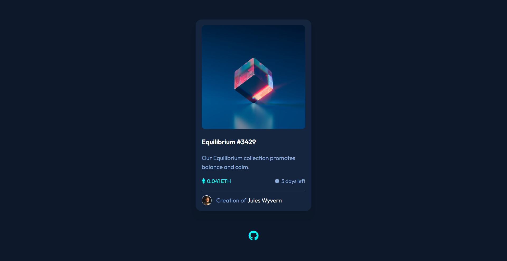

# NFT Card Component

## Links:
- [Challenge Link](https://www.frontendmentor.io/challenges/nft-preview-card-component-SbdUL_w0U)
- [Site Preview](https://robinjmm-nft-card.vercel.app/)

## About
This is my solution for the NFT Card Component challenge from [Frontendmentor.io](https://frontendmentor.io).

## User Stories
The user should be able to:
- View the optimal layout depending on their device's screen size.
- See hover states for interactive elements.

## Built with
- HTML5
- CSS
- SASS
- PostCSS
- Vite

## Acknowledgement
I'm very grateful to the people at [Frontendmentor.io](https://frontendmentor.io) for providing designs and challenges that help me improve my skills as a web developer.