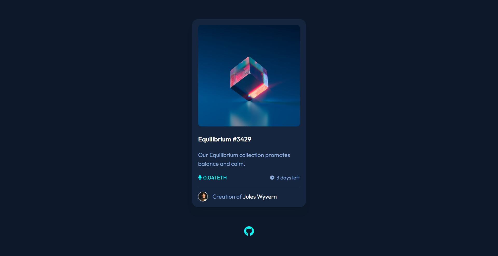

# NFT Card Component

## Links:
- [Challenge Link](https://www.frontendmentor.io/challenges/nft-preview-card-component-SbdUL_w0U)
- [Site Preview](https://robinjmm-nft-card-component.netlify.app/)

## About
This is my solution for the the challenge of building an NFT card component from [Frontendmentor.io](https://frontendmentor.io).

The goal for the challenge is to practice my skills in HTML and CSS and be able to build out a component design mockup from scratch.

## Built with
- Semantic HTML5 markup
- CSS
- Flexbox
- SASS

## Acknowledgement
I want to say **Thank you** to [Frontendmentor.io](https://frontendmentor.io) for providing designs and challenges that can help me improve my skills as a web developer. 